# **Задание 1**

1. Перед вами скриншот страницы карьерного сайта Авито. Изучите его, перечислите все имеющиеся баги, и укажите их приоритет (high, medium, low). Объясните, почему багам присвоенны именно они.

| № | Описание бага                                                                                   | Приоритет | Объяснение                                             | Скриншот                                  |
|---|-------------------------------------------------------------------------------------------------|-----------|--------------------------------------------------------|-------------------------------------------|
| 1 | Сообщение "Ничего не нашлось" располагается в центре страницы                                   | high      | Негативно влияет на пользовательский опыт              | 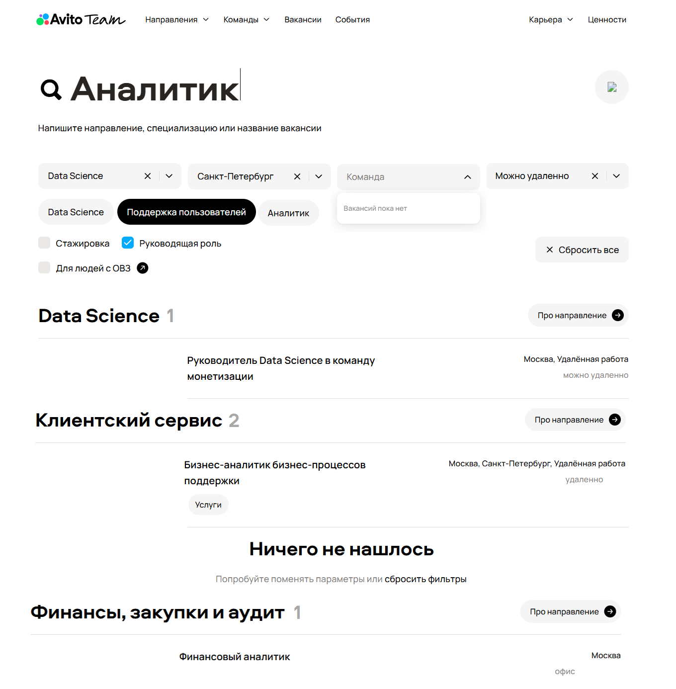                   |
| 2 | В фильтрах содержится два разных блока с выбором направления                                    | high      | Мешает правильной работе фильтров, что может привести к ошибкам в результатах поиска| 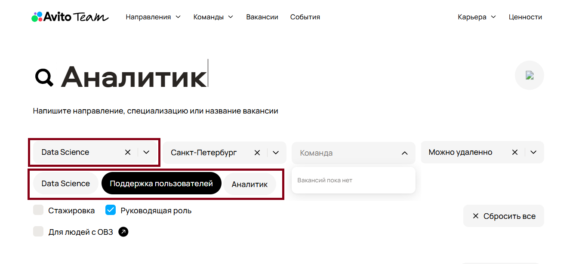|
| 3 | В вакансиях по направлениям "Data Sience" и "Финансы, закупки и аудит" отсутствуют названия команд| medium  | Не влияет на функционал, но может вызвать путаницу у пользователя| 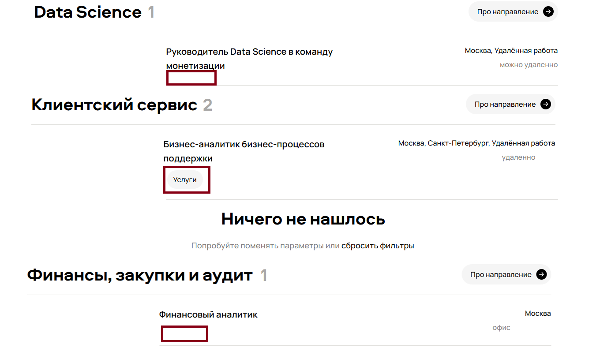|          
| 4 | В направлении "Клиентский сервис" заявлено две вакансии, но отображается только одна            | high      | Негативно влияет на бизнес-цели и пользовательский опыт| 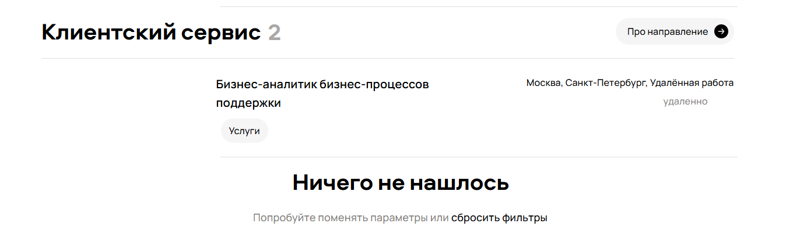                  |
| 5 | В некоторых вакансиях в строке с городами присутствует "Удалённая работа"                       | low       | Не влияет на восприятие вакансии                       | 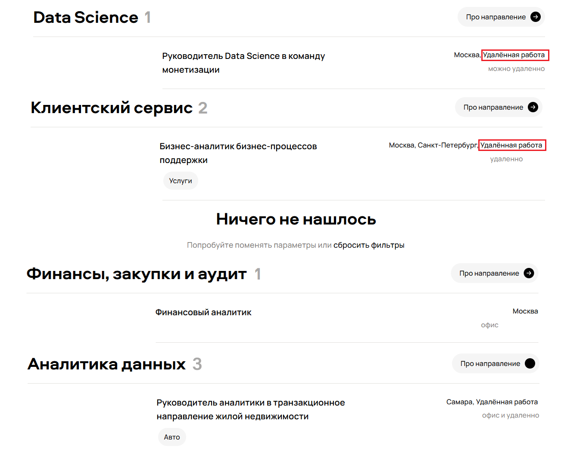                  |
| 6 | В вакансии "Бизнес-аналитик бизнес-процессов поддержки" формат работы "удаленно" (должно быть "можно удаленно")| low | Не влияет на восприятие вакансии              | 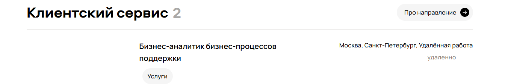                  |
| 7 | В вакансии "Аналитик данных в бизнес-команду Авито Авто" отсутствует название города работы     | high      | Негативно влияет на бизнес-цели и пользовательский опыт|                   |
| 8 | В направлении "Аналитика данных" на кнопке "Про направление" отсутствует стрелочка              | medium    | Не мешает функциональности, но визуально сильно заметно| 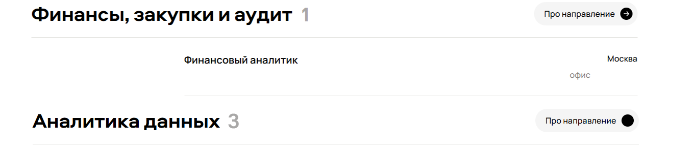                  |
| 9 | Смещены горизонтальные линии, подчеркивающие названия направлений и вакансий                    | low       | Не мешает функциональности, визуально почти незаметно  | 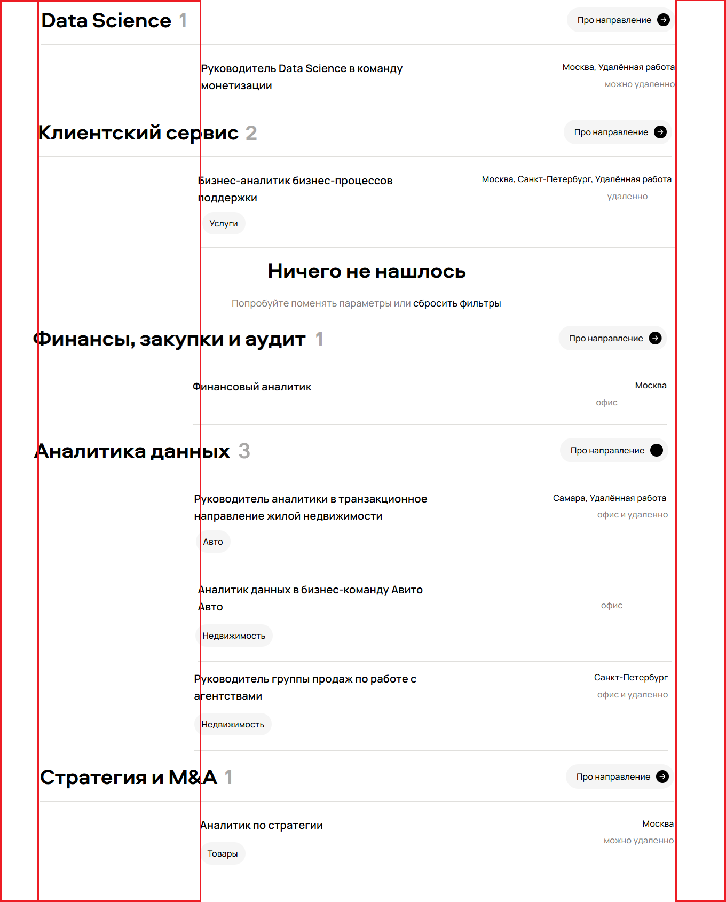                  |
|10 | В некоторых вакансиях смещен режим работы                                                       | medium    | Не мешает функциональности, но визуально сильно заметно| 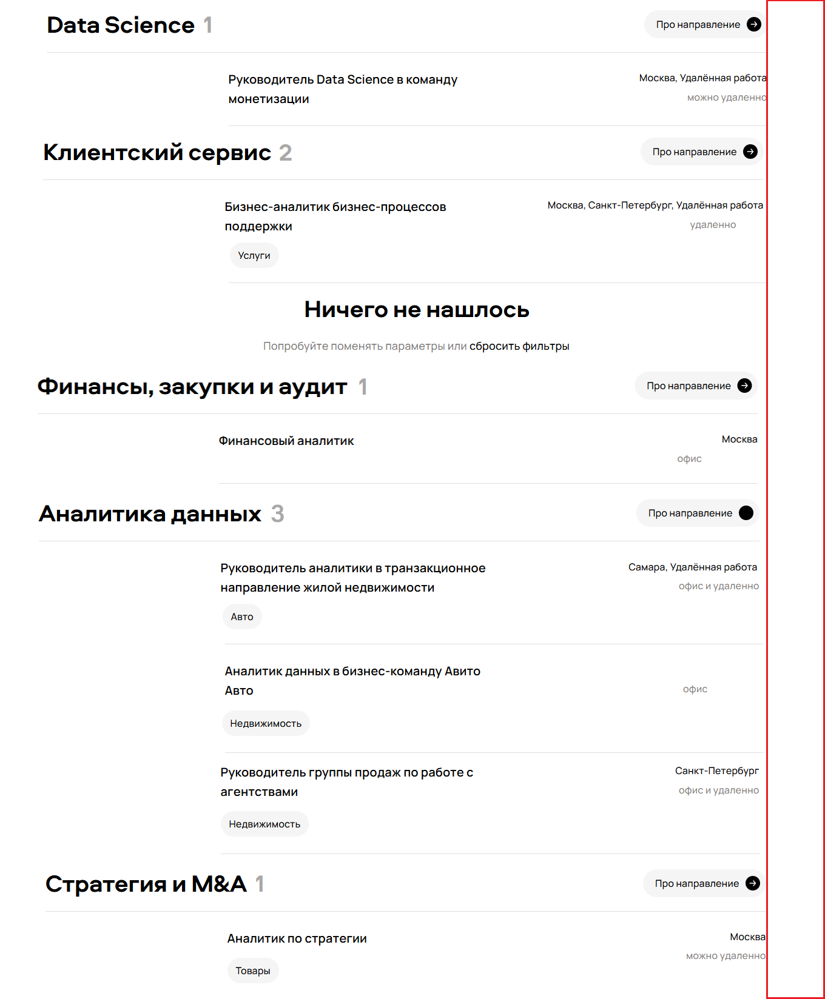                |
|11 | Отсутствует изображение на кнопке очистки строки поиска                                         | high      | Баг усложняет использование быстрой очистки поля       | 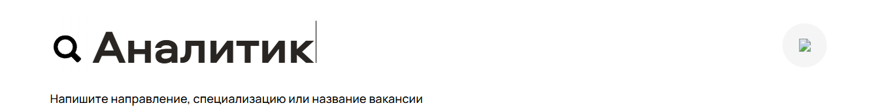                |
|12 | Наименование команды не совпадает с названием вакансии                                          | medium    | Не влияет на функционал, но может вызвать путаницу у пользователя| 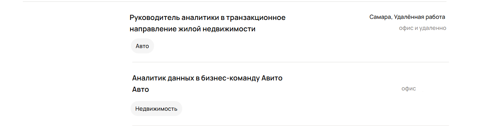      |